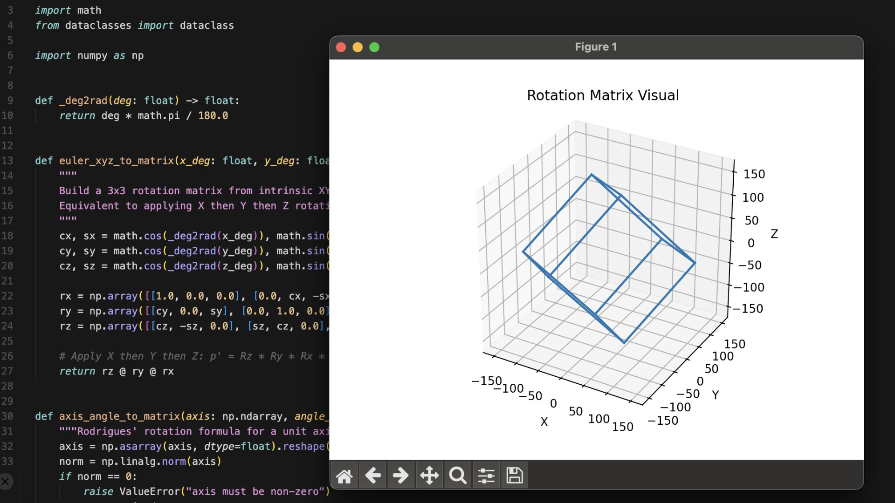

## Rotational Matrix (Quaternion Flow)



A small Python project for **visualizing rigid body rotations in ℝ³**.

It started as a single script applying sequential X/Y/Z Euler rotations to a hard-coded cube, mainly to explore how rotation composition behaves over time. It has since been refactored into a minimal, testable package exposing multiple parameterizations of rotations in **SO(3)** and their action on discrete point sets.

Features:

- **Rotation matrices**
  - Euler XYZ composition (order-dependent, non-commutative)
  - Axis–angle via Rodrigues’ formula  
- **Quaternions**
  - Unit quaternion representation of rotations (S³)
  - Stable incremental updates via repeated composition  
- **Matplotlib wireframe viewer**
  - Applies linear transforms directly to vertex sets  
- **CLI (`rotmat`)**
  - Parameterized control over rotation mode and angular velocity  


### Quick start

Create a virtual environment and install dependencies:

```bash
python3 -m venv .venv
source .venv/bin/activate
pip install -U pip
pip install -r requirements.txt
pip install -e '.[dev]'
```

Run the visualizer:

```bash
rotmat --shape cube --x 1 --y 2 --z 3
```

Or without installing the CLI script:

```bash
python -m rotational_matrix.cli --shape cube --x 1 --y 2 --z 3
```

### Examples

- **Rotate a tetrahedron** at 60 FPS:

```bash
rotmat --shape tetrahedron --fps 60 --x 0.5 --y 1.0 --z 1.5
```

- **Axis-angle rotation** around the axis \( (1, 1, 0) \):

```bash
rotmat --mode axis-angle --axis 1,1,0 --axis-deg 2.5 --shape cube
```

- **Quaternion mode** (incremental rotation per frame):

```bash
rotmat --mode quaternion --shape cube --x 1 --y 2 --z 3
```

### What’s in the codebase

- **`src/rotational_matrix/math3d.py`**: rotation math (Euler → matrix, axis-angle → matrix, quaternion helpers)
- **`src/rotational_matrix/shapes.py`**: simple wireframe shapes (cube, tetrahedron, axes)
- **`src/rotational_matrix/visualize.py`**: matplotlib animation loop (`FuncAnimation`)
- **`src/rotational_matrix/cli.py`**: argparse-powered CLI
- **`tests/`**: a few quick sanity tests (orthonormal matrices, norm preservation, matrix↔quaternion roundtrip)

---

### Notes / design choices

- **Why numpy?**  
  All transformations are vectorized:
  \[
  V' = R V
  \]
  This keeps the implementation close to the linear algebra while avoiding per-vertex loops and preserving orthogonality up to floating-point precision.

- **Why multiple modes?**

  - *Euler*  
    Direct and intuitive, but order-dependent and prone to drift under repeated application.

  - *Quaternion*  
    Represents rotations as unit elements on S³. Supports stable incremental updates:
    \[
    q_{t+1} = q_{\Delta} \cdot q_t
    \]
    Avoids numerical instability from repeated matrix multiplication.

  - *Axis-angle*  
    Minimal and geometrically explicit (axis + magnitude). Avoids ordering issues while remaining easier to interpret than quaternions.

### Dev checks

With the venv active:

```bash
ruff check .
pytest
```
